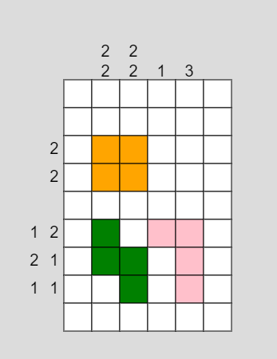
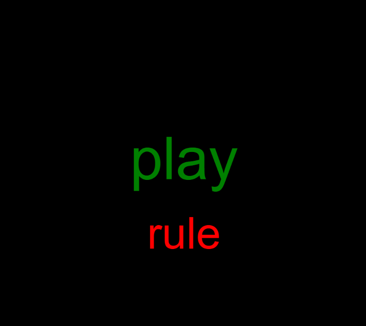
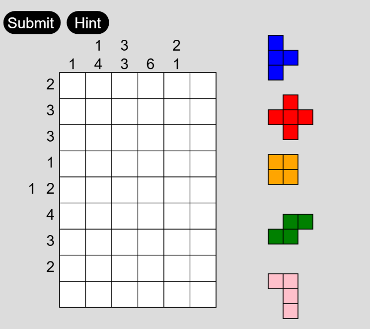
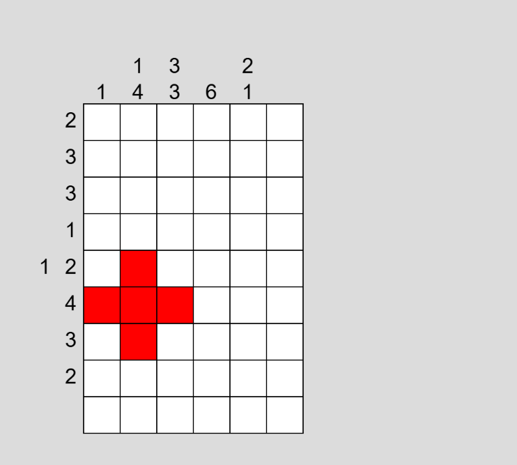
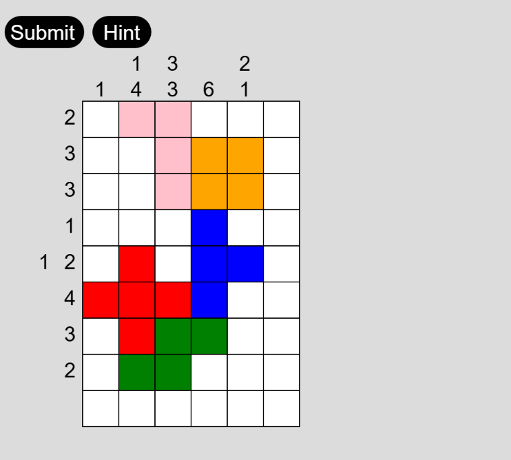

# Pixel quest

Play : https://nullchilly.github.io/pixel_quest/

The goal of the game is to fill in squares on the grid according to the numbers provided for each row and column, which indicate the lengths of consecutive blocks of filled-in squares.

# Example

The numbers at the top of each column and on the left side of each row provide clues about the filled squares.

For example a clue of "2 1" for a row means there are two consecutive filled squares followed by at least one empty square, and then one filled square.

# Some screenshots

Pressing hint button will yield this screen:

Let's trying to solve it..

Accepted!

